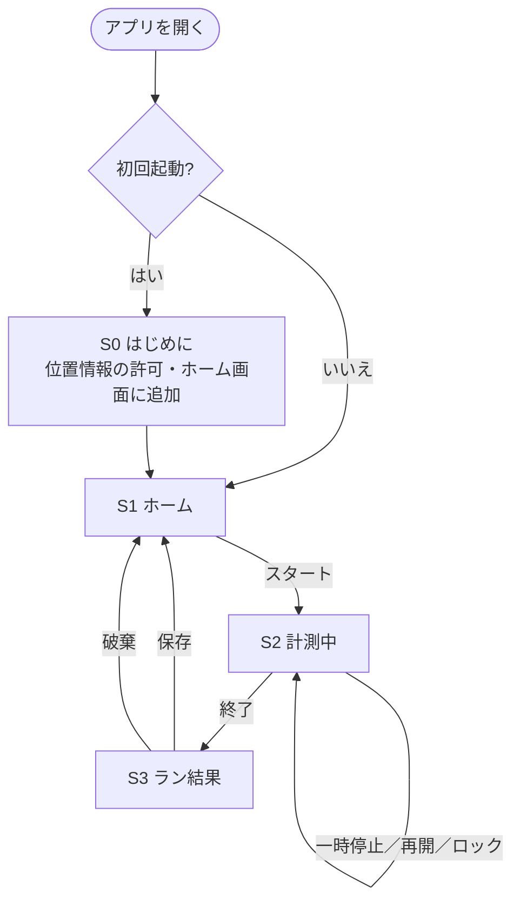
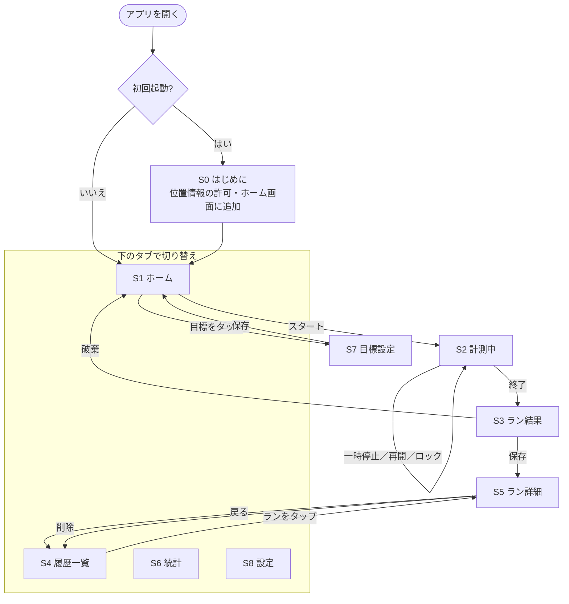

# ランrun 仕様書

> ステータス：ドラフト（v0.2）
> 最終更新：2026-09-29

## 1. 概要

走っている最中にスマホのGPSで距離・時間・ペースを計測し、記録を振り返って成長を見える化することで、ランニングの習慣化とモチベーション維持を支援するアプリ。

## 2. 目的

- **記録をつける**：距離・時間・ペースを残して成長を確認できるようにする
- **習慣化・モチベーション維持**：目標設定や連続記録で「続けたくなる」仕組みを用意する

## 3. 対象ユーザー

| 段階 | 対象 |
|---|---|
| 最初 | 自分と家族・友人など少人数で試す |
| その後 | ランニング初心者〜中上級者に向けて一般公開する |

- 初心者向けには「迷わず使えるわかりやすさ」を重視する
- 中上級者向けには「ペースや月間距離を細かく管理できること」を重視する

## 4. 利用シーン・対応端末

- **主な利用シーン**：走っている最中にスマホを持ち、GPSで自動計測する
- **対応端末**：iPhone／Androidのブラウザ（ホーム画面に追加してアプリとして使う）

## 5. 技術構成

| 項目 | 内容 |
|---|---|
| 形式 | PWA（HTML＋JavaScript） |
| 公開先 | GitHub Pages |
| 位置情報 | ブラウザの位置情報機能（Geolocation API） |
| 画面の点灯維持 | 画面スリープ防止機能（Screen Wake Lock API） |
| 地図 | Leaflet＋OpenStreetMap（無料・APIキー不要） |
| データ保存 | 端末の中だけ（IndexedDB） |
| ログイン | なし |
| オフライン対応 | Service Workerでアプリ本体をキャッシュし、圏外でも計測・記録できるようにする |

### 5.1 PWAにしたことによる制約と対策

| 制約 | 対策 |
|---|---|
| 画面を消したり、別アプリに切り替えたりすると、GPS計測が止まる（iPhoneでは必ず止まる） | 5.2の対策をとる |
| Apple Watchとは連携できない | 対象外とする（将来ネイティブアプリ化する場合に再検討） |
| データは端末の中だけなので、機種変更やブラウザのデータ削除で消える | 設定画面にデータの書き出し（バックアップ）・読み込み機能を用意する（あとで追加） |
| iPhoneのSafariは、ホーム画面に追加せずに使うと、しばらく使わないとデータが消えることがある | 初回起動時に「ホーム画面に追加」する手順を案内する |
| 圏外では地図が表示されない | ルート（位置の記録）は圏外でも保存し、地図は通信できるときに表示する |

### 5.2 画面オフ・ポケット収納時のGPS計測への対策（案）

iPhoneでは、PWA（ブラウザ・ホーム画面に追加したアプリどちらでも）は画面を消したりアプリを切り替えたりした時点で動作が止まり、GPS計測も止まる。Webの仕組み上、バックグラウンドで位置情報を取り続ける方法はない。そのため、次の対策を組み合わせる。

| No. | 対策 | 内容 | 時期 |
|---|---|---|---|
| 1 | 画面を点けたままにする | 計測中は画面スリープ防止機能で画面を消さない（iPhoneはiOS 18.4以降で対応） | MVP |
| 2 | ポケットでの誤操作防止 | 計測中は「ロック」ボタンで画面へのタッチを無効にする。解除は長押し。画面は黒地にして電池の消耗を抑える | MVP |
| 3 | 途切れても記録を続ける | 時間は開始時刻からの差で計算するので、途中で止まっても正しい値になる。GPSが途切れた区間は、止まる前と再開後の地点を直線で結んで距離を補い、「補完区間」として記録する | MVP |
| 4 | 画面が消えたことを知らせる | 計測に戻ったとき、途切れていた時間を表示する | MVP |
| 5 | ネイティブアプリ化 | Capacitorなどで今のHTML＋JavaScriptを包んでアプリにし、バックグラウンドでも計測できるようにする。App Storeの登録（年会費あり）が必要 | 将来 |

- 画面を点けたままにすると電池の消耗が大きくなるので、はじめにの画面と計測画面で注意を案内する
- 直線で補う距離は、カーブの多い道では実際より短くなる

## 6. 機能

### 6.1 MVP（最初に作るもの）

| No. | 機能 | 内容 | 画面 |
|---|---|---|---|
| 1 | はじめの案内 | アプリの説明、位置情報の許可、ホーム画面に追加する手順、電池についての注意 | S0 |
| 2 | かんたんなホーム | スタートボタン、今週の距離・回数、前回のランの概要 | S1 |
| 3 | GPS計測 | 距離・時間・ペースをリアルタイムで表示。一時停止・再開・終了ができる | S2 |
| 4 | ルート地図 | 計測中に現在地と走ったルートを地図に表示 | S2 |
| 5 | 画面オフ対策 | 5.2の対策1〜4 | S2 |
| 6 | ラン結果と保存 | 終わったランのまとめ（距離・時間・平均ペース・ルート）、メモ、保存／破棄 | S3 |

### 6.2 あとで追加

| 機能 | 内容 | 画面 |
|---|---|---|
| 履歴一覧・詳細 | 過去のランの一覧、1kmごとのラップ、ルート地図、削除 | S4・S5 |
| 集計グラフ | 週・月ごとの距離・回数・平均ペース | S6 |
| 目標設定と達成率 | 例：月50km、週3回。ホームに達成率を表示 | S7・S1 |
| 連続記録 | 「◯週連続で走った」をホームに表示 | S1 |
| バックアップ | データの書き出し（JSONファイル）・読み込み・全削除 | S8 |
| 音声ガイド | 「1km通過、ペース6分」など | S2 |
| 自動一時停止 | 信号待ちなど | S2 |
| 自己ベスト記録 | 5km・10kmの最速タイムなど | — |
| 達成バッジ・レベルアップ | — | — |
| リマインダー通知 | 走る予定の通知 | — |
| クラウド同期 | Googleでサインイン／メールアドレス。機種変更時の引き継ぎ用 | — |
| 友だち共有・ランキング・応援 | クラウド同期が必要 | — |
| Apple Watch・ヘルスケアアプリ連携 | ネイティブアプリ化が必要 | — |

> ⚠️ MVPには履歴画面とバックアップがないため、保存した過去のランはホームの「今週の距離・回数」「前回のラン」でしか確認できない。データは保存しておき、S4・S5を追加した時点で見られるようにする。

## 7. データ

端末の中（IndexedDB）に保存する。

| データ | 主な項目 | 時期 |
|---|---|---|
| ラン記録 | ID、開始日時、終了日時、距離（m）、走行時間（秒）、平均ペース、ルート（緯度・経度・時刻の配列）、補完区間、ラップ、メモ | MVP |
| 設定 | 距離の単位、初回案内を表示済みか | MVP |
| 目標 | 種類（距離／回数）、期間（週／月）、目標値 | あとで追加 |

## 8. 画面構成

### 8.1 MVPの画面

| No. | 画面 | 主な内容 |
|---|---|---|
| S0 | はじめに（初回のみ） | アプリの説明、位置情報の許可、ホーム画面に追加する手順、電池についての注意 |
| S1 | ホーム | スタートボタン、今週の距離・回数、前回のランの概要 |
| S2 | 計測中 | 距離・時間・ペースを大きく表示、現在地とルートの地図、一時停止／再開、ロック、終了 |
| S3 | ラン結果 | 終わったランのまとめ、メモ入力、保存／破棄 |

MVPでは下のタブは置かない。

### 8.2 あとで追加する画面

| No. | 画面 | 主な内容 |
|---|---|---|
| S4 | 履歴一覧 | 過去のランの一覧（日付・距離・時間・ペース） |
| S5 | ラン詳細 | ルート地図、1kmごとのラップ、メモ、削除 |
| S6 | 統計 | 週・月の切り替え、距離・回数・平均ペースのグラフ |
| S7 | 目標設定 | 目標の種類・期間・目標値を設定 |
| S8 | 設定 | 距離の単位、データの書き出し・読み込み・全削除、アプリについて |

S4以降を追加したら、画面下にタブを置き、**ホーム／履歴／統計／設定** の4つを切り替えられるようにする。計測中・ラン結果の画面ではタブを隠し、操作ミスを防ぐ。

### 8.3 全画面の移動の流れ（完成形）

MVPではS3で保存するとS1に戻るが、S5を追加したら保存後はS5に移動する。
