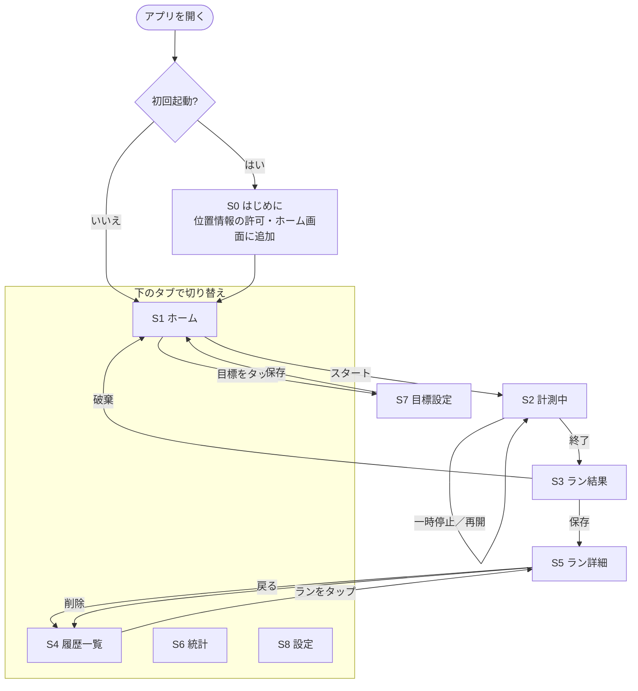

# ランrun 仕様書

> ステータス：ドラフト（v0.1）
> 最終更新：2026-09-29

## 1. 概要

走っている最中にスマホのGPSで距離・時間・ペースを計測し、記録を振り返って成長を見える化することで、ランニングの習慣化とモチベーション維持を支援するアプリ。

## 2. 目的

- **記録をつける**：距離・時間・ペースを残して成長を確認できるようにする
- **習慣化・モチベーション維持**：目標設定や連続記録で「続けたくなる」仕組みを用意する

## 3. 対象ユーザー

| 段階 | 対象 |
|---|---|
| 最初 | 自分と家族・友人など少人数で試す |
| その後 | ランニング初心者〜中上級者に向けて一般公開する |

- 初心者向けには「迷わず使えるわかりやすさ」を重視する
- 中上級者向けには「ペースや月間距離を細かく管理できること」を重視する

## 4. 利用シーン・対応端末

- **主な利用シーン**：走っている最中にスマホを持ち、GPSで自動計測する
- **対応端末**：iPhone／Androidのブラウザ（ホーム画面に追加してアプリとして使う）

## 5. 技術構成

| 項目 | 内容 |
|---|---|
| 形式 | PWA（HTML＋JavaScript） |
| 公開先 | GitHub Pages |
| 位置情報 | ブラウザの位置情報機能（Geolocation API） |
| 画面の点灯維持 | 画面スリープ防止機能（Screen Wake Lock API） |
| 地図 | Leaflet＋OpenStreetMap（無料・APIキー不要） |
| データ保存 | 端末の中だけ（IndexedDB） |
| ログイン | なし（v1では不要） |
| オフライン対応 | Service Workerでアプリ本体をキャッシュし、圏外でも計測・記録できるようにする |

### 5.1 PWAにしたことによる制約と対策

| 制約 | 対策 |
|---|---|
| 画面を消したり別アプリに切り替えたりすると、GPS計測が止まる（特にiPhone） | 計測中は画面スリープ防止機能で画面を点けたままにする。計測画面に「画面を消さないでください」と案内する |
| Apple Watchとは連携できない | v1の対象外とする（将来ネイティブアプリ化する場合に再検討） |
| データは端末の中だけなので、機種変更やブラウザのデータ削除で消える | 設定画面にデータの書き出し（バックアップ）・読み込み機能を用意する |
| iPhoneのSafariは、ホーム画面に追加せずに使うと、しばらく使わないとデータが消えることがある | 初回起動時に「ホーム画面に追加」する手順を案内する |
| 圏外では地図が表示されない | ルート（位置の記録）は圏外でも保存し、地図は通信できるときに表示する |

## 6. 機能

### 6.1 最初のバージョン（v1）

| No. | 機能 | 内容 |
|---|---|---|
| 1 | GPS計測 | 距離・時間・ペースをリアルタイムで表示。一時停止・再開・終了ができる |
| 2 | ルート地図 | 走ったルートを地図に表示（計測中・ラン詳細） |
| 3 | 履歴一覧・詳細 | 過去のランを新しい順に一覧表示。詳細では距離・時間・平均ペース・1kmごとのラップ・ルートを表示 |
| 4 | 集計グラフ | 週・月ごとの距離・回数・平均ペースをグラフで表示 |
| 5 | 目標設定と達成率 | 例：月50km、週3回。ホームに達成率を表示 |
| 6 | 連続記録 | 「◯週連続で走った」をホームに表示 |
| 7 | バックアップ | データの書き出し（JSONファイル）・読み込み・全削除 |

### 6.2 次のバージョン以降

- 音声ガイド（「1km通過、ペース6分」など）
- 自動一時停止（信号待ちなど）
- 自己ベスト記録（5km・10kmの最速タイムなど）
- 達成バッジ・レベルアップ
- 走る予定のリマインダー通知
- 友だち共有・ランキング・応援 ※クラウド保存とログインが必要
- クラウド同期（Googleでサインイン／メールアドレス） ※機種変更時の引き継ぎ用
- Apple Watch連携・ヘルスケアアプリ連携 ※ネイティブアプリ化が必要

## 7. データ

端末の中（IndexedDB）に保存する。

| データ | 主な項目 |
|---|---|
| ラン記録 | ID、開始日時、終了日時、距離（m）、走行時間（秒）、平均ペース、ルート（緯度・経度・時刻の配列）、ラップ、メモ |
| 目標 | 種類（距離／回数）、期間（週／月）、目標値 |
| 設定 | 距離の単位、初回案内を表示済みか |

## 8. 画面構成

### 8.1 画面一覧

| No. | 画面 | 主な内容 |
|---|---|---|
| S0 | はじめに（初回のみ） | アプリの説明、位置情報の許可、ホーム画面に追加する手順 |
| S1 | ホーム | 今週・今月の距離、目標の達成率、連続記録、「スタート」ボタン |
| S2 | 計測中 | 距離・時間・ペースを大きく表示、現在地とルートの地図、一時停止／再開、終了 |
| S3 | ラン結果 | 終わったランのまとめ、メモ入力、保存／破棄 |
| S4 | 履歴一覧 | 過去のランの一覧（日付・距離・時間・ペース） |
| S5 | ラン詳細 | ルート地図、1kmごとのラップ、メモ、削除 |
| S6 | 統計 | 週・月の切り替え、距離・回数・平均ペースのグラフ |
| S7 | 目標設定 | 目標の種類・期間・目標値を設定 |
| S8 | 設定 | 距離の単位、データの書き出し・読み込み・全削除、アプリについて |

画面下にタブを置き、**ホーム／履歴／統計／設定** の4つを切り替えられるようにする。計測中・ラン結果の画面ではタブを隠し、操作ミスを防ぐ。

### 8.2 画面の移動の流れ

